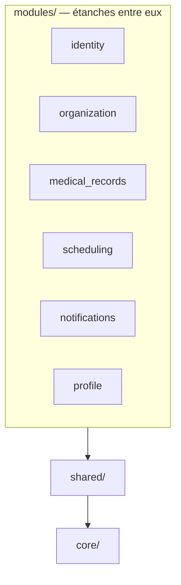

# ADR-0003 — Un monolithe modulaire découpé en modules métier

| Statut      | Date       | Tickets                                                                            |
| ----------- | ---------- | ---------------------------------------------------------------------------------- |
| **Accepté** | 2026-08-25 | BACK-04, BACK-04b, BACK-16, BACK-19, BACK-22, BACK-21 (à venir), BACK-32 (à venir) |

## Contexte

Décision rendue par BACK-04, qui pose l'ossature du service d'API. L'architecture est hexagonale
— ports et adaptateurs — mais l'hexagone seul ne dit pas **où passent les frontières métier**. Un
découpage par couches uniquement finit par produire un `domain/entities/` où quarante entités
s'empilent sans qu'aucune frontière ne dise laquelle répond à quelle question. À l'inverse, les
contextes métier du produit bougent encore : figer des frontières dans des services séparés
serait parier très tôt sur un découpage qu'on ne sait pas encore garantir juste.

## Décision

**Le service est un monolithe modulaire : un seul déploiement, des modules métier étanches, des
frontières tenues mécaniquement.** C'est le module qui porte la frontière ; la couche ne décrit
que le sens des dépendances, vers l'intérieur.

Six modules, chacun répondant à une question :

| Module            | Question à laquelle il répond                   | Ticket  |
| ----------------- | ----------------------------------------------- | ------- |
| `identity`        | peux-tu prouver qui tu es                       | BACK-04 |
| `organization`    | dans quelle structure travailles-tu, affecté où | BACK-16 |
| `medical_records` | de quels animaux s'agit-il                      | BACK-19 |
| `scheduling`      | quand, avec qui, pour quel acte                 | BACK-21 |
| `notifications`   | qui prévenir, par quel canal                    | BACK-22 |
| `profile`         | où habite ce particulier                        | BACK-32 |

Un module n'importe jamais l'intérieur d'un autre — ni entité, ni dépôt, ni jointure sur ses
tables : les échanges passent par les cas d'usage publics du module cible. Autour des modules,
deux espaces transverses : `shared/` (racine des erreurs, ports techniques, socles de persistance
et d'API) et `core/` (réglages du processus).

Ces règles ne reposent pas sur la discipline : depuis BACK-04b, **cinq contrats import-linter**
les font échouer en CI — pureté du domaine, sens des couches par module, indépendance des modules
même par chemin indirect, sens des couches de `shared/`, hiérarchie des espaces. Chaque contrat a
été cassé volontairement une fois, puis remis en état : un garde-fou qu'on n'a jamais vu échouer
est un garde-fou dont on ne sait rien.

## Alternatives écartées

### Des microservices

Les frontières deviendraient des frontières réseau : transactions distribuées, versionnement
d'API internes, exploitation multipliée par le nombre de services — pour des frontières que le
produit ne sait pas encore garantir justes, et une équipe d'une personne. Le monolithe modulaire
garde l'option ouverte : des modules qui ne s'importent pas s'extraient le jour où une frontière
a fait ses preuves.

### Un monolithe en couches, au domaine plat

Le défaut par lequel tout le monde commence, et le scénario que le contexte décrit : des dizaines
d'entités dans un seul `domain/`, reliées par des imports que personne ne surveille, jusqu'à ce
que tout dépende de tout. C'est précisément l'absence de frontière que ce choix corrige.

### Un module par frontend

Le piège le plus tentant, puisque le produit a trois applications. Mais `frontend-professional`,
`frontend-individual` et `frontend-admin` sont des **canaux de livraison**, pas des contextes
métier : le cœur d'authentification — hachage, OTP, 2FA, session, révocation — y est identique et
serait triplé à l'identique. Le type de compte est une propriété portée par `identity` ; c'est
l'audience du jeton qui sépare les trois applications.

## Conséquences

**Ce que cela donne.** Une violation de frontière échoue en CI au moment où elle s'écrit, pas six
mois plus tard en revue de code. Les contrats visent `app.modules.*` — un joker, pas une liste —
et couvriront chaque module le jour où il naîtra. Le déploiement reste celui d'un seul service.

**Ce que cela coûte.** Une discipline permanente : toute dépendance applicative ajoutée au projet
s'ajoute à la liste du contrat de pureté du domaine, dans la même pull request. Les échanges
entre modules sont parfois plus verbeux qu'une jointure — le compteur d'animaux d'une liste
d'administration viendra du cas d'usage public de `medical_records`, jamais d'un `JOIN` sur ses
tables. Et une entorse est assumée : la `Base` déclarative SQLAlchemy est partagée, parce que
tous les modules écrivent dans la même base et qu'Alembic ne voit qu'un registre de métadonnées à
la fois.

## Références

- [Architecture du service](../backend/architecture-du-service.md) — les trois espaces, la règle
  des 3 modèles, le trajet complet sur le module pilote `identity`.
- `backend/api/src/app/modules/__init__.py` — le tableau des modules et le piège du découpage par
  frontend.
- `backend/api/pyproject.toml`, section `[tool.importlinter]` — les cinq contrats et leurs
  justifications.
