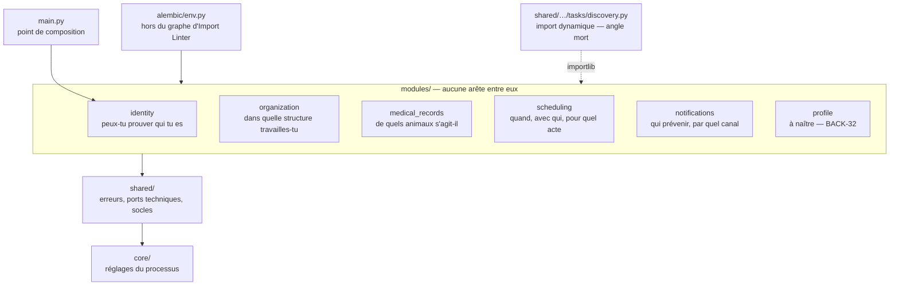
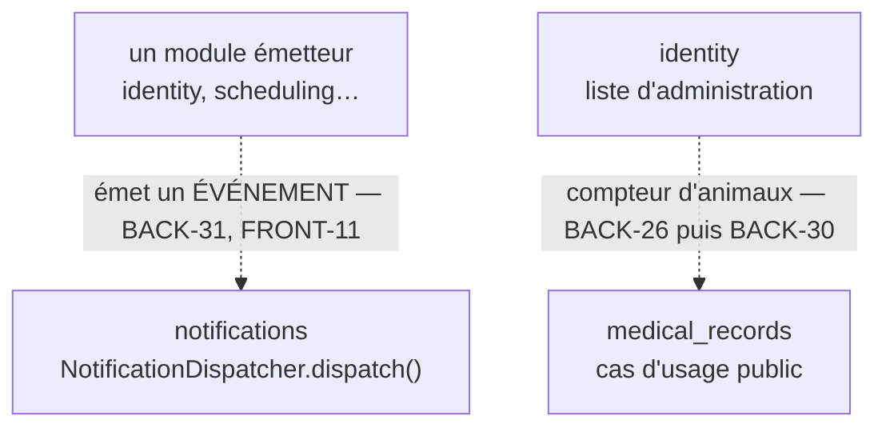

# Carte de contexte : qui expose quoi, qui consomme quoi

Une **carte de contexte** répond à trois questions : quels contextes métier existent, ce que
chacun accepte de montrer aux autres, et qui s'en sert. Elle est la pièce qui manque quand on
arrive sur un monolithe modulaire, parce qu'aucun fichier ne la porte à lui seul.

Les termes employés ici — module, surface publique, point de composition — sont définis au
[glossaire](./glossaire.md).

:::warning Cette carte est PROVISOIRE, et voici précisément ce que cela veut dire
Une frontière peut encore bouger **tant qu'aucun module ne consomme la surface publique d'un
autre**. C'est le cas aujourd'hui : aucun des cinq modules n'en importe un autre, ni directement
ni indirectement.

Ce n'est pas une intention, c'est un fait vérifiable : le contrat 3 le prouve à chaque
intégration continue, en suivant les chaînes d'imports.

Attention toutefois à ne pas en tirer plus qu'il n'y a. Trois fichiers atteignent déjà les
modules — `main.py`, `alembic/env.py` et `shared/…/tasks/discovery.py` — et deux d'entre eux
vont jusqu'à leur **intérieur**, pas à leur surface publique. Déplacer un module a donc déjà un
coût ; ce qu'il n'a pas encore, c'est un coût pour un autre **module**.
:::

## Ce que chaque module expose, et à qui

La surface publique d'un module est ce que son `__init__.py` déclare dans `__all__`, et rien
d'autre. Le reste lui appartient.

Cette page ne recopie pas ces listes : elles bougent à chaque ticket backend, et une copie
périmée serait pire que pas de copie. **Le fichier fait foi.**

| Module            | La question à laquelle il répond                | Ce qu'il expose                                                                                                   | Destiné à                    |
| ----------------- | ----------------------------------------------- | ----------------------------------------------------------------------------------------------------------------- | ---------------------------- |
| `identity`        | peux-tu prouver qui tu es                       | son **routeur**, et rien d'autre                                                                                  | le point de composition      |
| `organization`    | dans quelle structure travailles-tu, affecté où | ses deux **ports de dépôt**, son unité de travail, les entités et rôles qui forment leur contrat                  | le point de composition      |
| `medical_records` | de quels animaux s'agit-il                      | ses deux **ports de dépôt**, son unité de travail, ses entités et son vocabulaire d'espèces                       | le point de composition      |
| `scheduling`      | quand, avec qui, pour quel acte                 | son **port de dépôt**, son unité de travail, son agrégat, ses erreurs de plage horaire et son catalogue d'espèces | le point de composition      |
| `notifications`   | qui prévenir, par quel canal                    | son **`NotificationDispatcher`**, le catalogue d'événements, les canaux et la résolution des préférences          | les futurs modules émetteurs |
| `profile`         | où habite ce particulier                        | rien — **il n'existe pas encore** (BACK-32)                                                                       | —                            |

### Ce qui est délibérément absent de ces surfaces

Deux exclusions sont écrites et motivées dans les fichiers eux-mêmes. Elles disent mieux que
tout ce qu'une surface publique est censée être.

`notifications` n'exporte **pas** son déclencheur de tâches. L'exporter ferait croire qu'un
module émetteur peut l'assembler lui-même, alors que l'assemblage appartient au point de
composition.

`scheduling` n'exporte **pas** son erreur d'absence de fiche. Seule la méthode héritée du dépôt
générique la lève, et le port ne l'expose pas : l'exporter donnerait un nom que personne ne peut
attraper.

## La carte, aujourd'hui

**Le dessin est un arbre**, et c'est le fait le plus important de cette page : il n'y a aucune
arête **horizontale**. Le graphe d'imports réel, lui, n'est pas un arbre — `main.py` importe
aussi `shared/` et `core/`, et chaque module importe `core/` ; ces arêtes-là sont élidées pour
que l'absence d'arête entre modules se voie.

Trois flèches entrent dans `modules/`, et aucune ne vient d'un module.

`main.py` importe le routeur d'`identity`. C'est le **point de composition**, et sa docstring
assume qu'il va plus loin que la surface publique : il ouvre aussi le magasin de codes à usage
unique d'`identity`, une ressource de module que `shared/` n'a pas le droit de nommer.

`alembic/env.py` importe les modèles de persistance des cinq modules pour peupler le registre de
métadonnées — donc leur **intérieur** aussi. Il vit hors du paquet analysé par Import Linter, et
n'apparaît dans aucun contrat.

`shared/infrastructure/tasks/discovery.py` atteint `app.modules.<m>.infrastructure.tasks` par
`importlib`, au démarrage du worker. C'est l'entorse la plus délicate des trois : elle part de
`shared/`, l'espace que le contrat 5 rend précisément aveugle aux modules. Elle passe parce
qu'Import Linter ne suit pas les imports dynamiques — un **angle mort**, pas une permission — et
sa docstring la confine à ce seul fichier.

## Ce qui est prévu, et qui n'existe pas

Les deux flux ci-dessous sont **décidés et écrits** dans des ADR, mais aucune ligne de code ne
les emprunte encore. Ils sont en pointillés pour cette raison.

**Vers `notifications`.** Un module appelant émet un **événement**, jamais un canal. La méthode
ne porte aucun paramètre de canal et n'en portera pas : le canal se décide à la remise, une
seule fois, pour tous les modules. Voir
l'[ADR-0021](../adr/0021-notification-par-evenement.md).

**Vers `medical_records`.** La liste d'administration des comptes particuliers affichera un
nombre d'animaux. Ce compteur viendra du **cas d'usage public** de `medical_records`, jamais
d'une jointure sur ses tables. C'est l'exemple déjà arbitré de la règle d'indépendance.

### Le croisement qui n'est PAS un flux

Le cas le plus instructif est celui qu'on serait tenté de dessiner et qui ne doit pas l'être.

`scheduling` rend une disponibilité **déclarée** : les horaires qu'un praticien a saisis. Pour
savoir qui est réellement disponible, il faut croiser cette réponse avec les affectations
actives, qui appartiennent à `organization`.

Ce croisement **ne peut pas vivre dans `scheduling`** — le contrat le lui interdit — et il ne
vit pas davantage dans `organization`. Il appartient au **point de composition**, seul espace
autorisé à connaître deux modules. Le dessiner comme une flèche entre les deux inverserait le
sens de la décision. Voir l'[ADR-0026](../adr/0026-fiche-technique-praticien.md).

## Ce qui ne passe pas par la carte

Deux besoins traversent les modules sans jamais devenir une arête. Les réponses sont **opposées**,
et c'est la distinction la plus utile de tout le dépôt.

### Un besoin TECHNIQUE partagé descend dans `shared/`

`identity` et `notifications` avaient tous deux besoin du même dialogue SMTP, et ni l'un ni
l'autre ne pouvait importer l'autre. Le besoin est donc descendu dans `shared/domain/ports/`, où
les deux l'atteignent sans se connaître.

L'inverse — faire importer le second par le premier arrivé — aurait fait du premier une
dépendance du second, ce qui est exactement la frontière qu'on cherchait à préserver. Voir
l'[ADR-0022](../adr/0022-transport-email-partage.md).

### Un VOCABULAIRE métier partagé se recopie

`medical_records` et `scheduling` avaient besoin du même catalogue d'espèces. Il n'est **pas**
descendu dans `shared/`, réservé au besoin technique : il est **recopié**, à l'identique, et une
garde de non-dérive compare les deux catalogues.

Le précédent existait déjà : les trois types de compte d'`identity` sont recopiés dans le service
de jetons plutôt que d'en faire descendre l'énumération — arbitrage de BACK-10a, consigné au
[registre](../ecarts/back.md#écarts-assumés-avec-le-ticket-back-10a). La règle générale, elle,
est posée par l'[ADR-0026](../adr/0026-fiche-technique-praticien.md).

La règle tient en une phrase : **le besoin technique partagé descend, le vocabulaire métier
partagé se duplique et se garde.**

## Quand une frontière peut encore bouger

Tant qu'aucun module ne consomme la surface publique d'un autre, déplacer une responsabilité
d'un module vers un autre ne casse personne. C'est la fenêtre dans laquelle le projet se trouve,
et elle ne durera pas.

Le jour où un premier consommateur existera, le déplacement cessera d'être un détail
d'organisation : il deviendra une modification de contrat, avec un appelant à mettre à jour. Ce
que ce ticket ne fait pas, c'est décider de ce qui se passera alors — cette page **consigne** un
état, elle ne prend pas de décision.

Le découpage lui-même, ses six modules et les alternatives écartées, est décidé par
l'[ADR-0003](../adr/0003-monolithe-modulaire.md).

Les écarts assumés avec le ticket DOC-02a sont consignés au
[registre des écarts](../ecarts/doc.md#écarts-assumés-avec-le-ticket-doc-02a).
