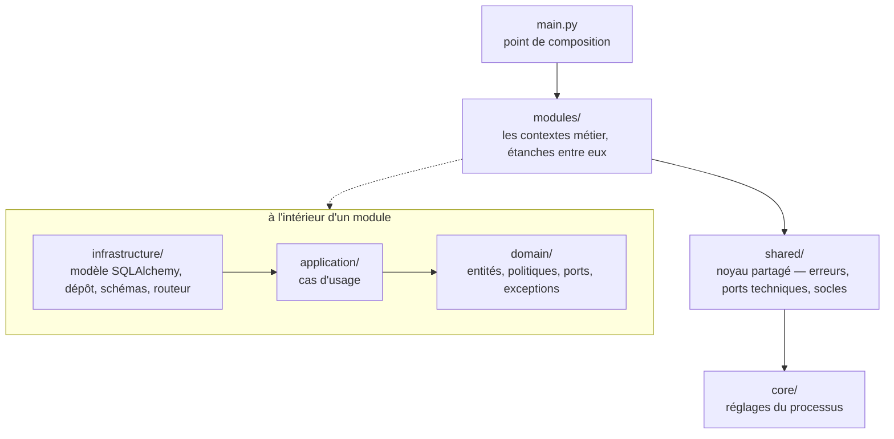
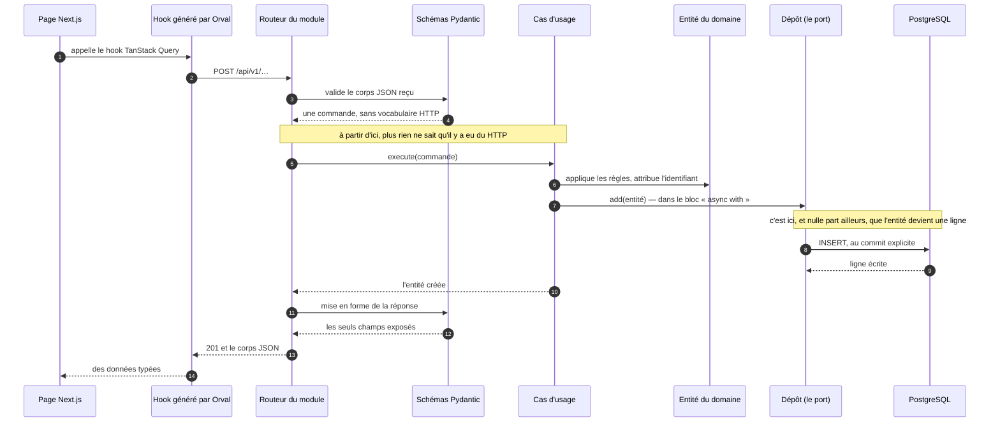

import Tabs from '@theme/Tabs';
import TabItem from '@theme/TabItem';

# Comment écrire un module conforme

Cette page est **normative** : elle dit ce qu'il faut faire, et ce qui se passe quand on ne le
fait pas. Elle décrit l'état des lieux le moins possible — pour savoir ce qui est posé
aujourd'hui et où, la section [Backend](../backend/index.md) est là pour ça.

**Le vocabulaire de cette page — module, couche, port, agrégat, unité de travail, doublure — est
défini au [glossaire](./glossaire.md).** Rien n'y est supposé connu, et il vaut la peine de
l'ouvrir dans un second onglet plutôt que de deviner un terme en cours de route.

:::info Ce que « conforme » veut dire
Un module conforme passe les **cinq contrats d'architecture** sans exception déclarée. Ces
contrats ne sont pas de la documentation : ce sont des règles vérifiées par
[Import Linter](../backend/qualite-et-typage.md#import-linter), qui font échouer l'intégration
continue. Cette page les cite par leur numéro ; les voici une fois pour toutes.

| #   | Nom                   | Ce qu'il interdit                                                       |
| --- | --------------------- | ----------------------------------------------------------------------- |
| 1   | `domain-purity`       | qu'un `domain/` atteigne une technologie, même par une chaîne indirecte |
| 2   | `module-layers`       | qu'une couche d'un module en importe une plus extérieure                |
| 3   | `module-independence` | qu'un module en importe un autre, dans les deux sens                    |
| 4   | `shared-layers`       | que `shared/domain/` importe `shared/infrastructure/`                   |
| 5   | `service-spaces`      | qu'un espace importe un espace situé au-dessus de lui                   |

Pour les jouer, depuis `backend/api/` : `make imports` ne lance qu'eux, `make lint` lance Ruff
**puis** eux. Résultat attendu dans les deux cas : `Contracts: 5 kept, 0 broken.`
:::

---

## Un hexagone par module, pas un domaine plat

L'architecture est hexagonale — ports et adaptateurs — **à l'intérieur de modules métier**.
C'est le **module** qui porte la frontière ; la couche ne décrit que le sens des dépendances.

La différence n'est pas cosmétique. Un découpage par couches seules produit un
`domain/entities/` où quarante entités s'empilent sans qu'aucune frontière ne dise laquelle
répond à quelle question. Au bout de deux ans, tout dépend de tout, et plus personne ne sait
quelle règle appartient à quel métier.

Le motif complet et les alternatives écartées sont dans
l'[ADR-0003](../adr/0003-monolithe-modulaire.md).

:::danger Le piège le plus tentant
Ne **jamais** calquer les modules sur les trois frontends — `professional`, `individual`,
`admin`. Ce sont des **canaux de livraison**, pas des contextes métier.

Le cœur d'authentification — hachage, code à usage unique, double authentification, session,
révocation — y serait identique et triplé à l'identique. Le type de compte est une **propriété**
portée par `identity` ; c'est l'audience du jeton qui sépare les trois applications.
:::

---

## Le sens des dépendances

C'est la seule direction que l'architecture interdit, et c'est celle qu'il faut connaître avant
tout le reste : **les dépendances pointent vers l'intérieur**. L'infrastructure dépend du
domaine, jamais l'inverse.



Une flèche se lit « peut importer ». L'absence de flèche en sens inverse est **la** règle :
`shared/` ne connaît aucun module, et `domain/` ne connaît aucune technologie.

`shared/` n'a que **deux** couches, `domain/` et `infrastructure/`. Il n'a pas
d'`application/`, et c'est voulu : le noyau partagé n'orchestre aucun cas d'usage.

### Ce que chaque espace a le droit d'importer

| Espace     | Ce qu'il porte                                                                              | Ce qu'il importe    |
| ---------- | ------------------------------------------------------------------------------------------- | ------------------- |
| `core/`    | les réglages du **processus** : configuration, journalisation                               | rien du métier      |
| `shared/`  | le noyau **partagé** : racine des erreurs, ports techniques, socles de persistance et d'API | `core/`             |
| `modules/` | les **contextes métier**, étanches les uns aux autres                                       | `core/`, `shared/`  |
| `main.py`  | l'assemblage, et rien d'autre                                                               | tout ce qui précède |

`core/` reste en place et n'est pas fondu dans `shared/` : ce qu'il contient règle le processus,
pas l'architecture.

### Les deux fichiers qui vivent hors des couches

Ils existent, ils sont légitimes, et ils ne sont **pas** de la même nature. Les confondre fait
perdre du temps à la première violation de contrat.

`unit_of_work.py` est une **exemption déclarée**. Il vit à la racine du module, hors des trois
couches, parce qu'il est le point d'assemblage du module : il importe l'infrastructure pour
servir les dépôts au cas d'usage. Le contrat 2 le nomme explicitement dans ses
`exhaustive_ignores`. C'est écrit dans la configuration, cela se relit, et cela ne surprend
personne.

`discovery.py` et `alembic/env.py` sont des **angles morts**. Ils atteignent les modules par
`importlib`, c'est-à-dire par une chaîne de caractères, et Import Linter ne suit pas les imports
dynamiques. `alembic/` est même hors du `root_package` : il n'entre pas du tout dans le graphe.

:::warning Un angle mort n'est pas une permission
Ces deux fichiers ne sont pas dispensés de la règle : ils sont seulement invisibles à l'outil qui
la vérifie. Un import dynamique ajouté ailleurs ne serait signalé par rien, et c'est
précisément pour cela que la pratique reste confinée à ces deux fichiers.
:::

### Ce qui tient ces règles : cinq contrats et trois réglages

Cinq contrats [Import Linter](../backend/qualite-et-typage.md#import-linter), déclarés dans
`backend/api/pyproject.toml`. Ils suivent les **chaînes** d'imports, pas les lignes : passer par
`shared/` pour atteindre un autre module ne les contourne pas.

Trois réglages sont à connaître avant d'y toucher.

**Les contrats 2, 4 et 5 sont `exhaustive`.** Un fichier ou un dossier ajouté là où ils
s'appliquent fait échouer le contrat tant qu'il n'est pas déclaré comme une couche. C'est l'échec
que l'on rencontre le plus souvent sans avoir rien cassé — la marche à suivre est sur la page
[des interdits](./anti-patterns.md#quand-un-contrat-casse-lire-le-message).

**`exclude_type_checking_imports` reste à `false`, à dessein.** Un import de SQLAlchemy placé
sous `if TYPE_CHECKING:` dans une entité reste un couplage du domaine à une technologie. Qu'il
ne coûte rien à l'exécution ne le rend pas acceptable.

**Toute dépendance applicative ajoutée au projet s'ajoute à la liste interdite du contrat 1,
dans la même pull request.** La règle s'étend à tout paquet qu'un adaptateur importe **par son
nom** : interdire `boto3` sans interdire `botocore` laisserait au domaine un chemin ouvert vers
exactement la même technologie.

Le jour où une exception devient inévitable, elle s'écrit dans le `ignore_imports` **du contrat
concerné** — jamais en désactivant le contrat — et elle porte son motif et sa date de revue. Le
gabarit exact, et la raison pour laquelle une exception devenue sans objet fait échouer le lint,
sont sur [Qualité et typage](../backend/qualite-et-typage.md#import-linter).

Il n'y en a **aucune** aujourd'hui, et c'est un chiffre qu'on aimerait garder.

---

## Le cycle de vie d'une requête

Voici le chemin que suit une donnée, de la page affichée à la ligne écrite en base. Chaque
flèche traverse une frontière, et chaque frontière a son modèle : c'est ce qui rend la
[règle des 3 modèles](#la-règle-des-3-modèles) inévitable plutôt qu'arbitraire.



Deux points de ce trajet valent d'être retenus, parce qu'ils décident d'où se rangent les
règles.

La **normalisation** — d'une adresse, d'un numéro de téléphone — est une politique du domaine,
appelée par la fabrique de l'entité. Elle n'est pas dans la route : un second point d'entrée
l'oublierait, et deux comptes naîtraient pour une seule personne.

Le choix des champs **exposés** se fait à la sortie, dans le schéma de réponse. L'entité, elle,
reste complète : c'est le métier qui en a besoin, pas le client HTTP.

:::warning Ce diagramme montre des pièces posées, pas un parcours exécutable
Le routeur d'`identity` est monté sous `/api/v1`, mais il **ne porte encore aucune route** —
elles arrivent avec BACK-28, BACK-29 et BACK-31. Chaque pièce du trajet existe et se teste
isolément ; l'enchaînement complet de bout en bout, lui, n'est pas encore jouable.
:::

Le trajet complet écrit fichier par fichier, sur le module pilote, est sur la page
[Architecture du service](../backend/architecture-du-service.md#le-trajet-sur-le-module-pilote).

---

## Le squelette d'un module

Ce qui suit est un module entier — les **treize** fichiers, en entier, pas des extraits. Il
s'appelle `demo` et n'existe **pas** dans le dépôt : il a été écrit, déposé dans
`backend/api/src/app/modules/`, passé aux cinq contrats, à Ruff et à Mypy, puis retiré.

Ce que la page affiche est le contenu exact de ces fichiers-là. Un lecteur qui les recopie
obtient un module qui compile, que Mypy accepte en mode strict, et que les cinq contrats
acceptent.

### L'arborescence

```text
backend/api/src/app/modules/demo/
├── __init__.py                    la surface publique -- un `__all__` explicite
├── unit_of_work.py                le point d'assemblage, hors des trois couches
├── domain/
│   ├── __init__.py
│   ├── entities.py                les entites, et leurs regles
│   ├── exceptions.py              les erreurs metier, a code namespace
│   └── ports.py                   les contrats : depot, unite de travail
├── application/
│   ├── __init__.py
│   └── use_cases/
│       ├── __init__.py
│       └── publish_note.py        une intention, un fichier
└── infrastructure/
    ├── __init__.py
    └── db/
        ├── __init__.py
        ├── models.py              les colonnes, les types, les contraintes
        └── repositories.py        la charniere entite <-> ligne
```

Cinq de ces treize fichiers sont des `__init__.py` de couche, qui ne portent qu'une docstring.
Ils sont donnés à l'étape 9, et l'avertissement qui les accompagne mérite d'être lu avant
d'en oublier un.

:::warning Ce que ce squelette n'a pas, et qu'un vrai module aura
Ce module s'arrête au domaine, au cas d'usage et à la persistance. Il lui manque quatre choses,
délibérément, parce que chacune appelle un développement que le guide ne peut pas tenir dans une
page :

- **la couche d'API** — `infrastructure/api/schemas.py` et `routes.py`, c'est-à-dire le premier
  des [trois modèles](#la-règle-des-3-modèles) et le routeur qui l'expose. Le trajet complet,
  fichier par fichier, est décrit sur
  [Architecture du service](../backend/architecture-du-service.md#le-trajet-sur-le-module-pilote) ;
- **la commande** — `PublishNote.execute()` reçoit ici un `UUID` nu, ce qui suffit à une
  intention aussi simple. Dès qu'un cas d'usage prend plus d'un argument, il prend une
  **commande** gelée, comme `CreateAccountCommand` dans `identity` ;
- **la doublure en mémoire et sa suite de conformité** — `infrastructure/memory/`, et la classe
  de base de conformité jouée des deux côtés. Voir
  [Doublures en mémoire](../backend/doublures-en-memoire.md) ;
- **la migration** — et surtout la ligne à ajouter dans `backend/api/alembic/env.py`, qui tient
  une **liste écrite à la main** des modules dont il importe les modèles. Un module absent de
  cette liste n'a jamais de table, et **rien ne le signale** : les contrats, Ruff et Mypy restent
  tous verts.
  :::

### 1. L'entité — elle porte ses règles

**Fichier : `domain/entities.py`.** La ligne surlignée est celle qui empêche l'entité d'être
anémique : l'invariant « on ne publie qu'une fois » est tenu **ici**, pas dans le cas d'usage.

```python title="backend/api/src/app/modules/demo/domain/entities.py" {50-52}
"""Entites du module demo -- DEUXIEME des trois modeles, et le seul qui a des regles."""

from dataclasses import dataclass, field
from datetime import UTC, datetime
from enum import StrEnum
from typing import Self
from uuid import UUID, uuid4

from app.modules.demo.domain.exceptions import NoteAlreadyPublishedError


class NoteStatus(StrEnum):
    """Etats successifs d'une note."""

    DRAFT = "draft"
    PUBLISHED = "published"


@dataclass(slots=True, kw_only=True)
class Note:
    """Une note redigee puis publiee.

    Construire l'objet directement est reserve a la RECONSTITUTION depuis la
    persistance. Une creation metier passe par `Note.create()`.
    """

    id: UUID
    title: str
    status: NoteStatus = NoteStatus.DRAFT
    published_at: datetime | None = field(default=None)

    @classmethod
    def create(cls, *, title: str) -> Self:
        """Cree une note neuve, en brouillon.

        Args:
            title: le titre, deja fourni par l'appelant.

        Returns:
            La note creee, en brouillon.
        """
        return cls(id=uuid4(), title=title.strip())

    def publish(self) -> None:
        """Publie la note, une seule fois.

        Raises:
            NoteAlreadyPublishedError: si la note est deja publiee.
        """
        if self.status is NoteStatus.PUBLISHED:
            message = "Cette note est deja publiee."
            raise NoteAlreadyPublishedError(message)
        self.status = NoteStatus.PUBLISHED
        self.published_at = datetime.now(UTC)
```

Aucun import de `sqlalchemy`, `pydantic` ni `fastapi`, et aucun d'`app.core` : le contrat 1
refuse les chaînes indirectes, et `app.core` importe Pydantic.

### 2. Les erreurs — un code en attribut de classe

**Fichier : `domain/exceptions.py`.** Le code est surligné parce que c'est lui qui voyagera
jusqu'au client HTTP, et qu'il ne se pose **jamais** à la construction.

```python title="backend/api/src/app/modules/demo/domain/exceptions.py" {11,17}
"""Erreurs metier du module demo, a code namespace."""

from typing import ClassVar

from app.shared.domain.exceptions import ConflictError, NotFoundError


class NoteNotFoundError(NotFoundError):
    """Aucune note ne porte cet identifiant."""

    code: ClassVar[str] = "demo.note.not_found"


class NoteAlreadyPublishedError(ConflictError):
    """La note est deja publiee."""

    code: ClassVar[str] = "demo.note.already_published"
```

### 3. Les ports — deux contrats, deux natures

**Fichier : `domain/ports.py`.** Ce fichier en porte deux : le **dépôt**, qui échange des
entités, et l'**unité de travail**, qui n'expose que les dépôts de ce module. Ils vivent
ensemble parce que le second déclare le premier ; ce sont bien deux notions distinctes, toutes
deux définies au [glossaire](./glossaire.md).

```python title="backend/api/src/app/modules/demo/domain/ports.py"
"""Ports metier du module demo -- les contrats, jamais leurs adaptateurs."""

from abc import ABC, abstractmethod
from uuid import UUID

from app.modules.demo.domain.entities import Note
from app.shared.domain.ports.unit_of_work import AbstractUnitOfWork


class NoteRepository(ABC):
    """Acces aux notes, exprime en entites du domaine.

    Le port n'expose QUE ce que les cas d'usage du module ont le droit de
    faire. L'implementation, qui herite du depot generique, sait aussi lister
    et supprimer : le port ne s'elargit pas parce que la classe sait faire plus.
    """

    @abstractmethod
    async def get(self, note_id: UUID, /) -> Note:
        """Retourne la note portant cet identifiant.

        Raises:
            NoteNotFoundError: si aucune note ne porte cet identifiant.
        """

    @abstractmethod
    async def add(self, note: Note, /) -> None:
        """Enregistre une note qui n'existait pas."""

    @abstractmethod
    async def save(self, note: Note, /) -> None:
        """Reporte sur la persistance l'etat d'une note deja connue."""


class DemoUnitOfWork(AbstractUnitOfWork):
    """Unite de travail du module : sa transaction, ses depots, rien d'autre."""

    @property
    @abstractmethod
    def notes(self) -> NoteRepository:
        """Le depot de notes, servi par le bloc `async with` en cours.

        Raises:
            RuntimeError: si aucun bloc n'est ouvert sur cette unite.
        """
```

### 4. Le cas d'usage — une intention, un fichier

**Fichier : `application/use_cases/publish_note.py`.** La première ligne surlignée est celle qui
décide de tout : le constructeur reçoit un **port**, jamais une session. Les suivantes sont le
bloc transactionnel.

```python title="backend/api/src/app/modules/demo/application/use_cases/publish_note.py" {12,26-30}
"""Cas d'usage : publier une note -- une intention, un fichier."""

from uuid import UUID

from app.modules.demo.domain.entities import Note
from app.modules.demo.domain.ports import DemoUnitOfWork


class PublishNote:
    """Publie une note existante."""

    def __init__(self, uow: DemoUnitOfWork) -> None:
        """Memorise l'unite de travail par laquelle le module lit et ecrit."""
        self._uow = uow

    async def execute(self, note_id: UUID) -> Note:
        """Publie la note et la retourne.

        Raises:
            NoteNotFoundError: si aucune note ne porte cet identifiant.
            NoteAlreadyPublishedError: si elle est deja publiee.
        """
        # Lecture, regle et ecriture dans le MEME bloc : c'est l'atomicite. Une
        # exception -- le refus de double publication compris -- sort du bloc
        # sans commit, donc sans rien ecrire.
        async with self._uow:
            note = await self._uow.notes.get(note_id)
            note.publish()
            await self._uow.notes.save(note)
            await self._uow.commit()

        return note
```

### 5. Le modèle de persistance — des colonnes, pas des règles

**Fichier : `infrastructure/db/models.py`.**

```python title="backend/api/src/app/modules/demo/infrastructure/db/models.py"
"""Modele de persistance de la note -- TROISIEME modele, et le seul qui parle SQL."""

from datetime import datetime

from sqlalchemy import DateTime, String
from sqlalchemy.orm import Mapped, mapped_column

from app.shared.infrastructure.db.base import Base
from app.shared.infrastructure.db.mixins import TimestampMixin, UUIDPrimaryKey


class NoteModel(UUIDPrimaryKey, TimestampMixin, Base):
    """Table des notes du module de demonstration."""

    __tablename__ = "demo_notes"

    title: Mapped[str] = mapped_column(String(200))
    status: Mapped[str] = mapped_column(String(20))
    published_at: Mapped[datetime | None] = mapped_column(DateTime(timezone=True))
```

`TimestampMixin` ajoute `created_at` et `updated_at` que l'entité **n'a pas**, et c'est normal :
aucune règle métier de la note n'en dépend. Le jour où une règle en aurait besoin, c'est
l'entité qui gagnerait le champ, pas l'inverse.

`TenantMixin` n'est pas déclaré ici. Il est **opt-in**, et ne se pose que sur les agrégats
produits par un groupe et conservés sous sa garde — voir
l'[ADR-0013](../adr/0013-filtre-de-tenance-dans-le-depot.md).

### 6. Le dépôt — la charnière, et le seul mapping du module

**Fichier : `infrastructure/db/repositories.py`.** Les deux fonctions surlignées sont le mapping,
écrit à la main, et c'est le cœur de la règle des 3 modèles.

```python title="backend/api/src/app/modules/demo/infrastructure/db/repositories.py" {17,26}
"""Adaptateur SQLAlchemy du port `NoteRepository` -- la charniere du module."""

from app.modules.demo.domain.entities import Note, NoteStatus
from app.modules.demo.domain.exceptions import NoteNotFoundError
from app.modules.demo.domain.ports import NoteRepository
from app.modules.demo.infrastructure.db.models import NoteModel
from app.shared.infrastructure.db.repositories.base import SqlAlchemyRepository


class SqlAlchemyNoteRepository(SqlAlchemyRepository[Note, NoteModel], NoteRepository):
    """Depot de notes adosse a PostgreSQL."""

    _model_type = NoteModel
    _not_found_error = NoteNotFoundError
    _not_found_message = "Aucune note ne porte l'identifiant {entity_id}."

    def _to_entity(self, model: NoteModel) -> Note:
        """Reconstitue l'entite du domaine a partir d'une ligne de la table."""
        return Note(
            id=model.id,
            title=model.title,
            status=NoteStatus(model.status),
            published_at=model.published_at,
        )

    def _apply_to_model(self, entity: Note, model: NoteModel) -> None:
        """Reporte l'etat d'une note sur sa ligne, sans toucher a `id`."""
        model.title = entity.title
        model.status = entity.status.value
        model.published_at = entity.published_at
```

`_apply_to_model` ne reporte **jamais** `id` : une entité ne change pas d'identité, et le dépôt
générique est seul à le poser, à la création.

### 7. L'unité de travail — le point d'assemblage

**Fichier : `unit_of_work.py`**, à la racine du module. C'est le seul fichier du module qui a le
droit de connaître à la fois le port et son adaptateur, et il livre trois choses : la classe, la
fonction qui la fournit à une requête, et l'alias qu'une route annotera.

Les deux lignes surlignées sont celles qui portent la règle : le port rencontre son adaptateur,
et le type exposé reste le **port**.

```python title="backend/api/src/app/modules/demo/unit_of_work.py" {28,41}
"""Unite de travail du module demo -- a la RACINE du module, hors des couches.

NE JAMAIS IMPORTER CE FICHIER DEPUIS `application/` : il nomme l'infrastructure,
et le contrat `module-layers` refuse la chaine `application -> infrastructure`.
"""

from typing import Annotated

from fastapi import Depends, Request

from app.modules.demo.domain.ports import DemoUnitOfWork, NoteRepository
from app.modules.demo.infrastructure.db.repositories import SqlAlchemyNoteRepository
from app.shared.infrastructure.db.session import get_database
from app.shared.infrastructure.db.unit_of_work import SqlAlchemyUnitOfWork


class SqlAlchemyDemoUnitOfWork(SqlAlchemyUnitOfWork, DemoUnitOfWork):
    """Unite de travail du module demo adossee a PostgreSQL."""

    @property
    def notes(self) -> NoteRepository:
        """Le depot de notes, servi par le bloc `async with` en cours.

        Une propriete PARESSEUSE, et non un attribut : elle repasse par la garde
        a chaque acces, si bien qu'un depot ne peut jamais etre servi hors d'un
        bloc ouvert ni survivre a sa sortie.
        """
        return SqlAlchemyNoteRepository(self._active_session)


async def get_demo_uow(request: Request) -> DemoUnitOfWork:
    """Fournit l'unite de travail du module demo pour la requete en cours.

    UNE INSTANCE PAR REQUETE. L'unite livree est FERMEE : la session ne s'ouvre
    qu'au `async with` du cas d'usage.
    """
    return SqlAlchemyDemoUnitOfWork(get_database(request).sessionmaker)


# Le type expose est le PORT : une route ne sait pas quelle technologie la sert.
DemoUowDep = Annotated[DemoUnitOfWork, Depends(get_demo_uow)]
```

### 8. La surface publique — un `__all__` explicite

**Fichier : `__init__.py`.** Le re-export est explicite parce que Mypy tourne avec
`no_implicit_reexport` : un simple import ne suffirait pas à rendre les noms importables depuis
`app.modules.demo`.

```python title="backend/api/src/app/modules/demo/__init__.py"
"""Module demo : le squelette de reference, jamais livre.

SURFACE PUBLIQUE
Ce paquet exporte ce dont le POINT DE COMPOSITION a besoin. Un autre module qui
aurait affaire aux notes passera par les cas d'usage publics, jamais par ce depot.
"""

from app.modules.demo.domain.entities import Note, NoteStatus
from app.modules.demo.domain.ports import DemoUnitOfWork, NoteRepository
from app.modules.demo.unit_of_work import DemoUowDep, get_demo_uow

__all__ = [
    "DemoUnitOfWork",
    "DemoUowDep",
    "Note",
    "NoteRepository",
    "NoteStatus",
    "get_demo_uow",
]
```

Ce que cette surface vise, et ce qu'elle ne vise pas, est le sujet de la
[carte de contexte](./carte-de-contexte.md#ce-que-chaque-module-expose-et-à-qui).

### 9. Les cinq `__init__.py` de couche

Chaque dossier en porte un, même quand il ne contient qu'une docstring — sans quoi Ruff échoue
sur `D104`, et il se passe pire encore.

```python title="backend/api/src/app/modules/demo/domain/__init__.py"
"""Couche domaine du module demo."""
```

```python title="backend/api/src/app/modules/demo/application/__init__.py"
"""Couche application du module demo."""
```

```python title="backend/api/src/app/modules/demo/application/use_cases/__init__.py"
"""Cas d'usage du module demo -- un fichier par intention."""
```

```python title="backend/api/src/app/modules/demo/infrastructure/__init__.py"
"""Couche infrastructure du module demo."""
```

```python title="backend/api/src/app/modules/demo/infrastructure/db/__init__.py"
"""Persistance du module demo."""
```

:::danger Un `__init__.py` oublié rend le dossier invisible aux cinq contrats
On croirait que Python refuse d'importer un dossier sans `__init__.py`. **C'est faux** : depuis
PEP 420, c'est un _paquet-espace de noms_, et l'import fonctionne parfaitement.

Ce qui ne fonctionne plus, c'est la vérification. Import Linter construit son graphe avec
`grimp`, qui ne suit pas les paquets-espaces de noms — mesuré : retirer les cinq `__init__.py` de
ce module fait passer l'analyse de **211 à 203 fichiers**, et `lint-imports` continue d'afficher
`5 kept, 0 broken` avec un `import sqlalchemy` en plein `domain/`.

Un `__init__.py` oublié ne casse donc rien. Il éteint silencieusement les cinq garde-fous sur
tout un dossier.
:::

### Vérifier son module

Trois commandes, depuis `backend/api/`. Elles ne disent pas la même chose et il faut les trois.

Les **règles d'architecture** — c'est ce qui répond « ce module est-il à sa place ». Attendu :
`Contracts: 5 kept, 0 broken.`

```bash
make imports
```

Le **style et les docstrings** — Ruff exige une docstring de module sur chaque fichier, y compris
les `__init__.py`. Attendu : `All checks passed!`

```bash
make lint
```

`make lint` enchaîne Ruff **puis** `make imports` : c'est la commande à lancer si l'on n'en lance
qu'une. `make imports` reste utile quand on ne veut vérifier que les frontières.

Le **typage**, en mode strict. Attendu : `Success: no issues found`.

```bash
make typecheck
```

## La règle des 3 modèles

La même notion métier est représentée **trois fois**, dans trois technologies, et le passage de
l'une à l'autre s'écrit à la main.

| Modèle                | Fichier                         | Technologie    | Son rôle                                                        |
| --------------------- | ------------------------------- | -------------- | --------------------------------------------------------------- |
| Schéma d'API          | `infrastructure/api/schemas.py` | Pydantic       | valider l'entrée, mettre en forme la sortie, documenter OpenAPI |
| Entité du domaine     | `domain/entities.py`            | dataclass      | les règles et l'état ; zéro dépendance technique                |
| Modèle de persistance | `infrastructure/db/models.py`   | SQLAlchemy 2.0 | colonnes, types et contraintes                                  |

C'est la règle qui surprend le plus, parce qu'elle ressemble à de la répétition. Elle n'en est
pas : chacun des trois répond à une question différente, et les fondre les rendrait tous les
trois moins bons.

Le modèle de persistance porte `created_at` et `updated_at` dont aucune règle métier ne dépend.
L'entité porte des méthodes qu'une table ne peut pas porter. Le schéma d'API choisit les champs
**exposés**, qui ne sont pas tous ceux que le métier connaît.

:::danger Ne jamais écrire `Entity(**model.__dict__)`
Cela marcherait aujourd'hui, et casserait **en silence** au premier champ que le domaine nomme
autrement que la base — en remplissant l'entité de valeurs par défaut. Personne ne verrait rien
avant que la donnée soit fausse en production.

Le mapping explicite, lui, échoue chez Mypy et non en production. Il rend aussi visibles les
conversions qui comptent : `str` en base, énumération dans le domaine.
:::

### La commande n'est pas un quatrième modèle

Entre le schéma d'API et le cas d'usage passe une **commande** : une dataclass gelée qui décrit
une _intention_, pas un état persistant.

Elle existe pour que le cas d'usage puisse être appelé depuis une route, une tâche de fond ou
une commande en ligne sans que sa signature change à chaque fois. Elle est gelée à dessein : une
commande déjà transmise ne se corrige pas en chemin.

---

## Un port, ses adaptateurs

Un **port** exprime un besoin du métier. L'**adaptateur** le remplit avec une technologie. Le
domaine ne connaît que le port, ce qui laisse remplacer MinIO par Amazon S3, ou Redis par autre
chose, sans qu'une ligne de métier bouge.

Le meilleur moyen de comprendre ce que cela achète est de regarder un port avec ses deux
adaptateurs, côte à côte. Les deux répondent au **même** contrat, `AccountRepository` ; le cas
d'usage ne sait pas lequel il tient.

<Tabs>
<TabItem value="port" label="Le port" default>

```python title="backend/api/src/app/modules/identity/domain/ports.py"
class AccountRepository(ABC):
    """Acces aux comptes, exprime en entites du domaine."""

    @abstractmethod
    async def get(self, account_id: UUID, /) -> Account: ...

    @abstractmethod
    async def find_by_email(self, email: str) -> Account | None: ...

    @abstractmethod
    async def add(self, account: Account, /) -> None: ...

    @abstractmethod
    async def save(self, account: Account, /) -> None: ...
```

Quatre méthodes, et **ni `list` ni `delete`** : voir « le port rétrécit la surface » plus bas.

</TabItem>
<TabItem value="sql" label="L'adaptateur PostgreSQL">

```python title="backend/api/src/app/modules/identity/infrastructure/db/repositories.py"
class SqlAlchemyAccountRepository(SqlAlchemyRepository[Account, AccountModel], AccountRepository):
    """Depot de comptes adosse a PostgreSQL."""

    _model_type = AccountModel
    _not_found_error = AccountNotFoundError
    _not_found_message = "Aucun compte ne porte l'identifiant {entity_id}."

    async def find_by_email(self, email: str) -> Account | None:
        # La comparaison passe par `lower(email)` : c'est la SEULE forme que
        # l'index `ix_accounts_email_lower` sait servir -- une egalite sur la
        # colonne nue repartirait en parcours de table.
        ...
```

</TabItem>
<TabItem value="memory" label="La doublure en mémoire">

```python title="backend/api/src/app/modules/identity/infrastructure/memory/repositories.py"
class InMemoryAccountRepository(InMemoryRepository[Account], AccountRepository):
    """Depot de comptes en memoire, ecritures en attente de validation."""

    _not_found_error = AccountNotFoundError
    _not_found_message = "Aucun compte ne porte l'identifiant {entity_id}."

    async def find_by_email(self, email: str) -> Account | None:
        # La comparaison met la valeur RANGEE en minuscules, exactement comme
        # `func.lower(...)` cote SQLAlchemy. Une comparaison exacte ici
        # declarerait l'adresse LIBRE alors que la production la refuse.
        for row in self._scope():
            if row.entity.email.lower() == email:
                return row.entity
        return None
```

Le message d'absence est celui du dépôt réel, **mot pour mot** : la suite de conformité compare
les deux implémentations.

</TabItem>
</Tabs>

### Comment s'écrit un port

**Un port est une `abc.ABC`, écrite en bibliothèque standard seule.** La contrainte n'est pas de
style : le contrat 1 refuse les chaînes indirectes, donc un port ne peut pas non plus importer
`app.core`, qui importe Pydantic.

**Un port ne lit donc jamais la configuration.** Tout ce qui en dépend appartient à
l'adaptateur, et se pose par une fabrique `build_…(settings)`.

**Ses méthodes sont `async` quand elles font une entrée-sortie, et synchrones sinon.** La
majorité en font, mais pas toutes : `FileStorage.generate_presigned_url` est synchrone parce que
signer une URL ne demande aucun appel réseau, `TokenService.audience_for` parce qu'elle ne fait
que traduire un type de compte, et les propriétés de dépôts d'une unité de travail parce
qu'elles ne font que construire une enveloppe.

**`typing.Protocol` est réservé au typage structurel**, et ne s'hérite pas. Il sert à dire
« cet objet a un `.id` » ou « cet objet sait se fermer », pas à déclarer un contrat métier.
Aucune implémentation du dépôt ne sous-classe `Repository`.

**Le port rétrécit la surface.** `SqlAlchemyAccountRepository` hérite du dépôt générique et sait
donc lister et supprimer. Le port, lui, n'expose ni `list` ni `delete` : **le port ne s'élargit
pas parce que la classe sait faire plus.** Ce que le port ne nomme pas, aucun cas d'usage ne
peut l'appeler.

**Chaque port dit ce qui se passe en cas de panne**, et cette réponse **ne s'hérite pas** du port
précédent. `Cache` dégrade, parce qu'un cache absent ne change qu'une latence. `FileStorage`
lève, parce qu'un stockage absent change les résultats — un envoi silencieux est un fichier
perdu. `BreachChecker` dégrade lui aussi, mais pour un motif sans rapport avec celui du cache :
refuser une inscription parce qu'un service tiers est muet coûte plus cher que le risque
couvert.

**Écrire un port sans son adaptateur est l'exception**, et elle se justifie par un ticket
**antérieur** qui en a besoin — pas par un emplacement qu'on se réserve.

---

## L'unité de travail : une par module, jamais globale

Elle délimite une transaction, et sert les dépôts du module pendant sa durée. La forme est
toujours celle-ci, dans le cas d'usage — c'est exactement ce qu'écrit
`application/use_cases/publish_note.py` à l'étape 4 du squelette :

```python title="dans un cas d'usage, quel que soit le module"
async with uow:
    note = await uow.notes.get(note_id)
    note.publish()
    await uow.notes.save(note)
    await uow.commit()
```

**Une unité de travail par module, jamais globale.** Ce qu'on ne peut pas placer dans une seule
transaction devient alors une frontière **visible** — `identity` et `organization` ne partagent
pas leur atomicité — plutôt qu'une dette invisible que le premier incident révélera.

**Le cas d'usage reçoit un port, jamais une session.** C'est le type déclaré dans son
constructeur, et c'est l'assemblage — la route, le test, la tâche de fond — qui décide quel
adaptateur arrive là.

**Le commit est explicite.** Sortir du bloc sans avoir appelé `commit()` n'écrit rien : le
rollback est structurel, porté par la seule méthode concrète du port.

**Les dépôts sont des propriétés, pas des attributs.** Un attribut posé à l'entrée du bloc
survivrait à sa sortie, dépôt mort en main. Une propriété repasse par la garde à chaque accès.

Le détail — les trois règles du contrat, le cycle de vie de la session — est sur la page
[Unité de travail](../backend/unite-de-travail.md), et le motif dans
l'[ADR-0009](../adr/0009-unite-de-travail-par-module.md).

---

## Des doublures, pas des mocks

Le projet teste par **doublures**. Un mock vérifie qu'un appel a eu lieu ; une doublure se
comporte comme la vraie chose.

**Ce qu'une doublure doit reproduire** : tout ce qui est observable. Le filtre de tenance, les
écritures en attente jusqu'au commit, les erreurs d'absence du module, la composition des clés
avec le **vrai** compositeur.

**Ce qu'elle ne doit pas reproduire** : les contraintes du **stockage** — unicité, clés
étrangères, `NOT NULL`, verrous, ordre des `NULL`. Les inventer serait mentir dans l'autre sens.

:::warning Une doublure complaisante est pire que pas de test
Une doublure dont le `rollback()` ne ferait rien validerait une sémantique que l'implémentation
réelle ne tient pas. La suite passerait au vert, et la première transaction annulée en
production écrirait quand même.
:::

**La doublure suit son port.** Celles des ports **techniques** vivent dans
`shared/infrastructure/memory/` ; celles des ports **métier** dans
`<module>/infrastructure/memory/`. Ce n'est pas un rangement de convenance : le contrat 5
interdit à `app.shared` d'importer `app.modules`, donc un `FakeOtpSender` posé dans `shared/`
fait échouer `make lint`.

**Une doublure qui gagne un comportement gagne sa ligne de conformité dans le même commit.** La
suite de conformité est écrite **une fois**, dans une classe de base que pytest ne collecte pas,
puis jouée contre les deux implémentations par deux sous-classes qui ne fournissent que la
fixture du sujet. Un test ajouté à la base est donc mécaniquement joué des deux côtés.

Le détail des doublures livrées est sur la page
[Doublures en mémoire](../backend/doublures-en-memoire.md), et le motif dans
l'[ADR-0023](../adr/0023-doublures-en-memoire-et-conformite.md).

---

## Les erreurs : typées dans le domaine, traduites à la bordure

**Le domaine lève des exceptions typées, jamais des `HTTPException`.** Un `HTTPException` levée
depuis le domaine rendrait le même code inutilisable depuis une tâche de fond, où personne
n'attend de code HTTP — et le contrat 1 l'interdit de toute façon, `fastapi` et `starlette`
étant tous deux dans la liste interdite.

**Chaque erreur porte un code en attribut de classe**, au format
`<module>.<ressource>.<erreur>`. En attribut de **classe**, et jamais posé à la construction :
le code identifie la classe de refus, pas l'occurrence, et reste ainsi greppable en production.

**La traduction en HTTP se fait à la bordure, en un seul endroit.** Un adaptateur unique
enregistré par `create_app()` transforme toute erreur du domaine en réponse au format
`{ code, message, details, request_id }` — quatre clés, toujours présentes.

**Une ressource d'un autre groupe répond 404, jamais 403.** Un 403 confirmerait l'existence de
la ressource chez un concurrent.

:::info La règle du 404 a un périmètre
Elle vaut pour l'**isolation entre groupes**, et pour elle seule. Un refus de **droit** sur une
ressource que l'appelant a le droit de voir se dit bien par un 403 : `PermissionDeniedError`
existe et se traduit ainsi.
:::

**Une panne technique n'est pas un refus métier.** Elle sort en 500, avec un corps figé et la
trace au journal. Certaines descendent malgré tout de `DomainError` parce que le contrat de leur
port l'exige — le handler les **re-lève** alors vers le 500, plutôt que de les déguiser en refus
métier.

Le détail — la hiérarchie complète, le format, les sondes — est sur la page
[Erreurs](../backend/erreurs.md), et le motif dans
l'[ADR-0014](../adr/0014-traduction-des-erreurs-a-la-bordure.md).

Les écarts assumés avec le ticket DOC-02a sont consignés au
[registre des écarts](../ecarts/doc.md#écarts-assumés-avec-le-ticket-doc-02a).
