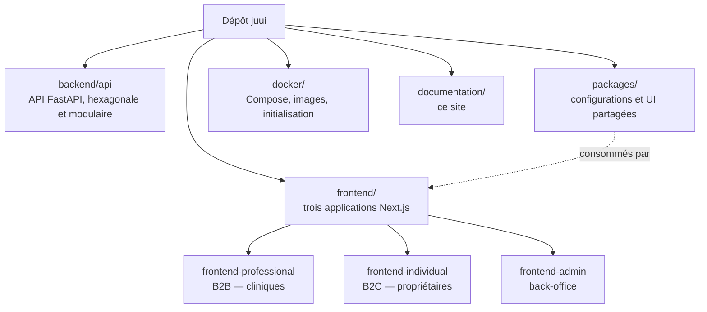

# Documentation technique de Juui

Juui est une plateforme SaaS B2B2C de prise de rendez-vous et de gestion pour cliniques
vétérinaires : agenda et gestion du cabinet côté professionnels, carnet de santé numérique et
réservation en ligne côté propriétaires d'animaux, back-office d'administration côté plateforme.

Ce site rassemble la documentation **technique** du dépôt, et il en porte le **détail** : chaque
sujet — une image Docker, un port applicatif, une convention, une décision — y a sa page, et n'en
a qu'une. Les README du dépôt gardent l'**entrée en matière et le démarrage express** : de quoi
cloner, créer les `.env` et lancer la pile sans quitter le
[README de la racine](https://github.com/kederiku/juui#readme), puis un renvoi ici pour tout le
reste. Quand une information existe aux deux endroits, le site fait foi.

## Le monorepo en un coup d'œil



Deux chaînes d'outils cohabitent et sont indépendantes : **pnpm** pilote `frontend/*`, `packages/*`
et `documentation`, **uv** pilote le seul `backend/api`.

## Lire ce site en local

Le site est un workspace pnpm comme les autres. Depuis la racine du dépôt :

```bash
pnpm --filter documentation dev
```

Il écoute sur le port **3004** — [http://localhost:3004](http://localhost:3004) — réservé pour lui
dans [l'allocation des ports du dépôt](../infrastructure/ports-et-services.md), et donc à l'abri
des trois applications.

La **barre de recherche fait exception** : son index n'est produit qu'à la construction du site.
Sous `dev`, elle est absente. Pour l'essayer, il faut construire puis servir :

```bash
pnpm --filter documentation build && pnpm --filter documentation start
```

## Ce que contient chaque section

| Section                                      | Ce qu'on y trouve                                                     | Apportée par       |
| -------------------------------------------- | --------------------------------------------------------------------- | ------------------ |
| [Démarrer](./installation.md)                | Installer le poste, démarrer la pile, les conventions du dépôt.       | livrée             |
| [Architecture](../architecture/index.md)     | Règles hexagonales, carte de contexte, sens des dépendances.          | livrée             |
| [Backend](../backend/index.md)               | Le service d'API : modules, persistance, tâches de fond.              | livrée             |
| [Frontend](../frontend/index.md)             | Les trois applications, la bibliothèque partagée, le client généré.   | livrée             |
| [Infrastructure](../infrastructure/index.md) | Ports, images Docker, mode développement, services de développement.  | livrée             |
| [Décisions (ADR)](../adr/index.md)           | Les décisions structurantes, leur motif et les alternatives écartées. | livrée             |
| [Écarts assumés](../ecarts/index.md)         | Les écarts entre chaque ticket et son livrable, avec leur raison.     | au fil des tickets |

Toutes les sections sont vivantes : chaque ticket livré y dépose ou y met à jour sa page dans la
même PR. La section Architecture est la seule **normative** — elle dit ce qu'il faut faire, quand
les autres décrivent ce qui est posé.
