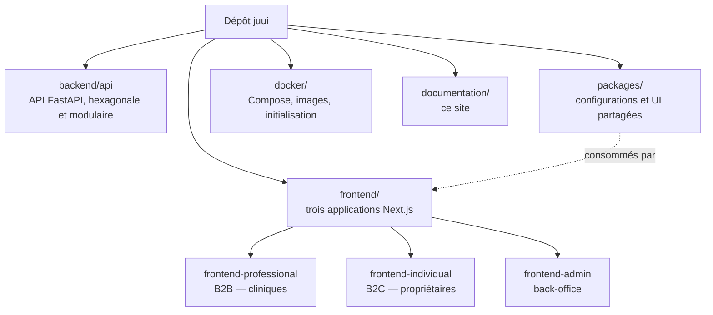

# Documentation technique de Juui

Juui est une plateforme SaaS B2B2C de prise de rendez-vous et de gestion pour cliniques
vétérinaires : agenda et gestion du cabinet côté professionnels, carnet de santé numérique et
réservation en ligne côté propriétaires d'animaux, back-office d'administration côté plateforme.

Ce site rassemble la documentation **technique** du dépôt. Il répond au « pourquoi » — pourquoi
cette frontière entre modules, pourquoi cet outil plutôt qu'un autre — là où le
[README de la racine](https://github.com/kederiku/juui#readme) répond au « comment » : prérequis,
installation, ports, commandes. Les deux sont complémentaires et ne se recopient pas.

## Le monorepo en un coup d'œil



Deux chaînes d'outils cohabitent et sont indépendantes : **pnpm** pilote `frontend/*`, `packages/*`
et `documentation`, **uv** pilote le seul `backend/api`.

## Lire ce site en local

Le site est un workspace pnpm comme les autres. Depuis la racine du dépôt :

```bash
pnpm --filter documentation dev
```

Il écoute sur le port **3004** — [http://localhost:3004](http://localhost:3004) — réservé pour lui
dans le tableau des ports du README, et donc à l'abri des trois applications.

La **barre de recherche fait exception** : son index n'est produit qu'à la construction du site.
Sous `dev`, elle est absente. Pour l'essayer, il faut construire puis servir :

```bash
pnpm --filter documentation build && pnpm --filter documentation start
```

## Ce que contient chaque section

| Section                                      | Ce qu'on y trouve                                                     | Apportée par        |
| -------------------------------------------- | --------------------------------------------------------------------- | ------------------- |
| [Architecture](../architecture/index.md)     | Règles hexagonales, carte de contexte, sens des dépendances.          | DOC-02a             |
| [Backend](../backend/index.md)               | Le service d'API : modules, persistance, tâches de fond.              | tickets BACK        |
| [Frontend](../frontend/index.md)             | Les trois applications, la bibliothèque partagée, le client généré.   | tickets FRONT       |
| [Infrastructure](../infrastructure/index.md) | Conteneurs, services de développement, intégration continue.          | tickets INFRA et QA |
| [Décisions (ADR)](../adr/index.md)           | Les décisions structurantes, leur motif et les alternatives écartées. | DOC-02b             |

Les pages de ces sections sont aujourd'hui des **pages d'attente** : DOC-01 pose le site, son
arborescence et son outillage ; le contenu arrive avec les tickets nommés ci-dessus.
